# GPA-Buddy（请出题）：在AI时代无痛学习
一个帮助大学生期末无痛复习的AI工具。可以从**Moodle等系统导入**（或手动上传）学习资料，生成**练习题**和**知识导图**。系统根据学生的掌握情况，**实时调整学习策略**，做到主动学习、以练代学。学习过程中还可以随时向AI导师提问，导师也会根据提问内容优化出题策略。

AI能力由**Google Cloud Agent Platform** 提供。

README.md为90%以上手写

## 运行方式
### 1.打开网页[https://www.gpa-buddy.com](https://www.gpa-buddy.com/index.html)

### 2.点击右上角按钮登录
一定要登录，不然只能体验部分功能。这里提供一个测试账号：

Email:test1@gpa-buddy.com

password:firebird

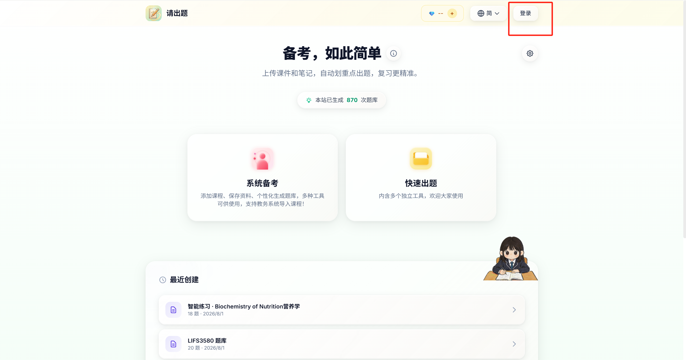

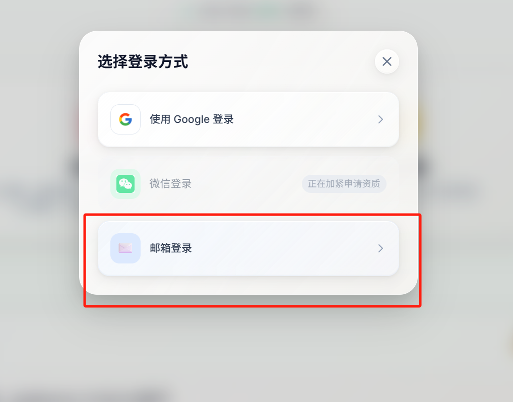

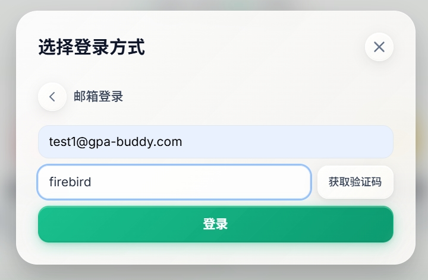


### 3.进入‘系统备考’界面，可以创建/导入新课程

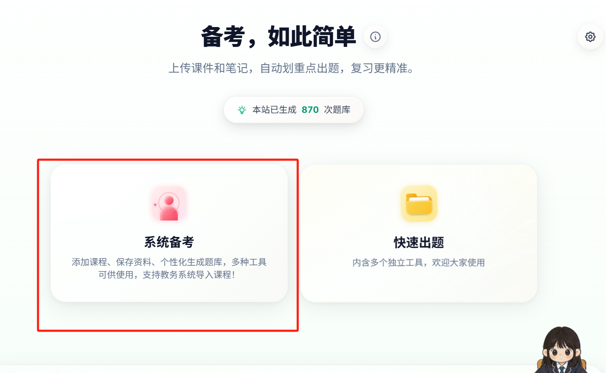

### 4.添加课程，任意起一个名字，也可以**从Moodle导入**。
目前Moodle使用我们自己搭的测试服，里面只有两门课。
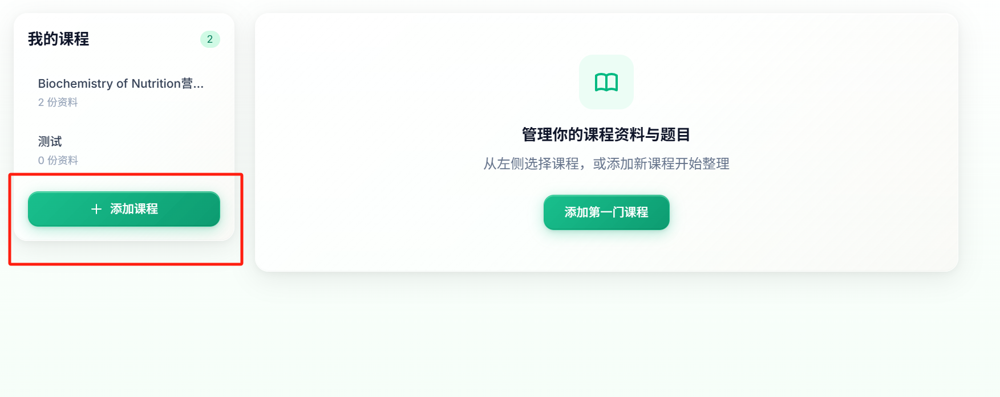

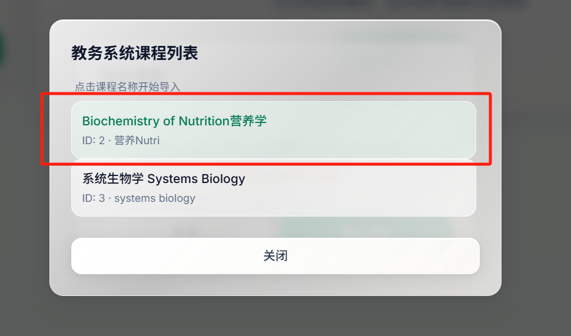

### 5.课程里面的文件会自动出现。可以用这些文件出题。出题时服务器返回**流式SSE数据**，可以实时查看出题进度。
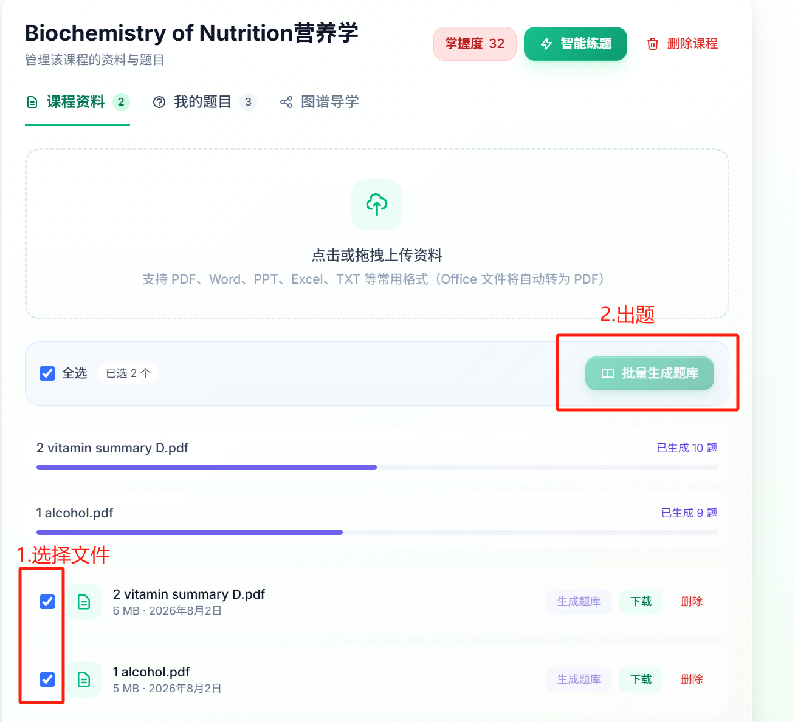

### 6.在‘我的题目’里面做题。
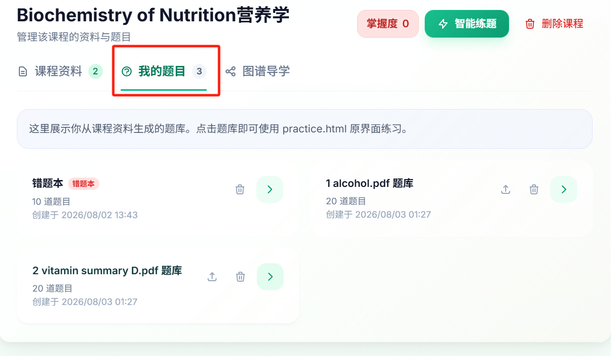

### 7.点击‘智能练题’进入**推荐算法模式**，此时系统会根据你的熟练度给你安排学习计划，推荐下一题做什么。
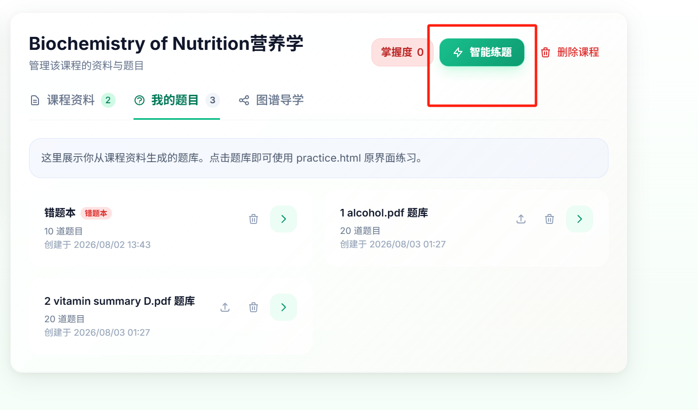

### 8.做题时可以查看原文，得知题目指向的知识点。不懂的也可以问内置的AI（背后是一个**Google Cloud Agent Runtime**）
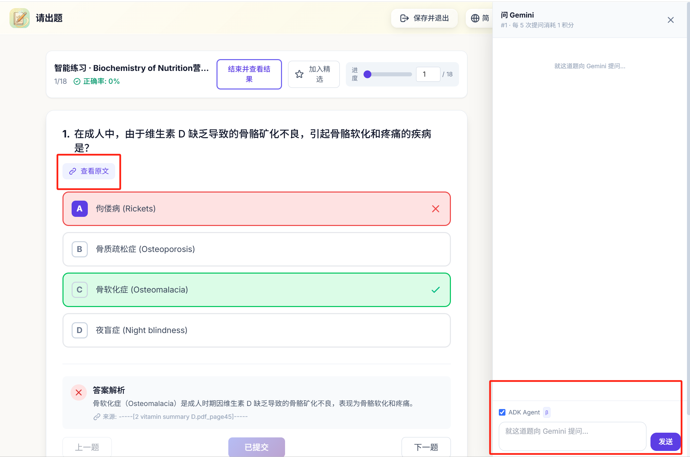

### 9.进入‘图谱导学’可以构建思维导图。AI会把文件内容拆分为若干知识点，并按照逻辑关系把它们串起来。
思维导图生成较慢，请耐心等候5-10分钟。
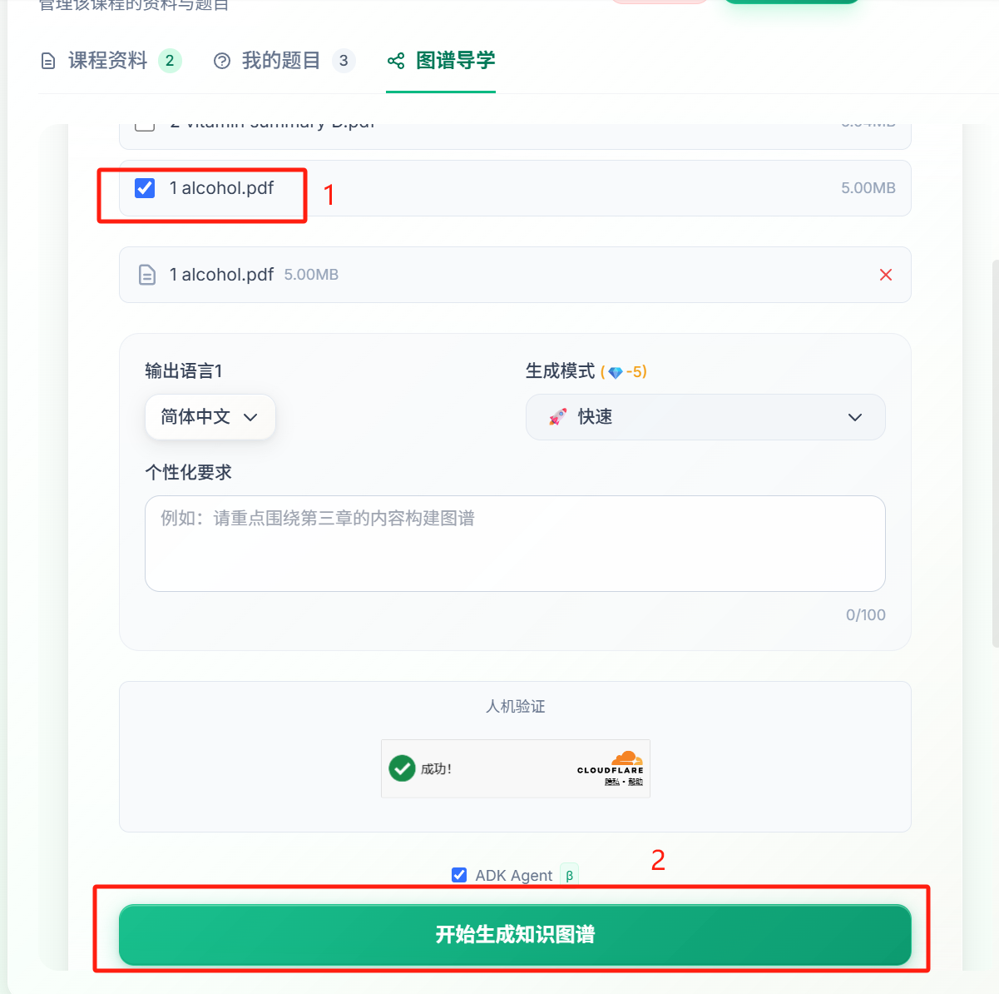

### 10.可以点击思维导图上的节点查看其内容。每个节点包括背景、讲解和检测题目。**通关一个节点才能解锁下一个**。
同样，在节点里也可以查看原文。
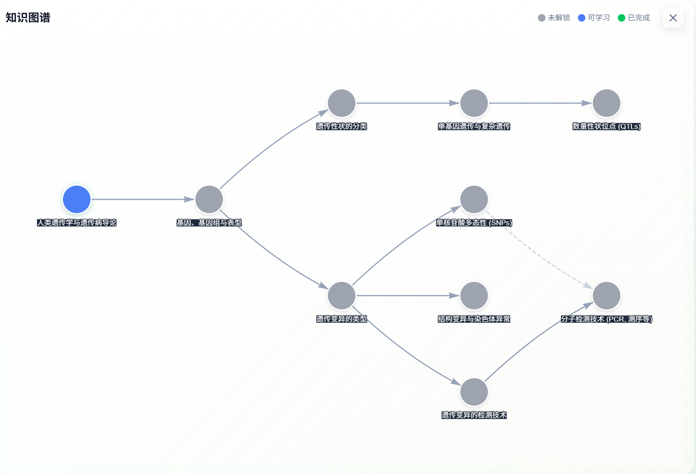

### 11.如果实在不想登录，可以在主页点击‘快速出题’，体验单个拆分出的功能
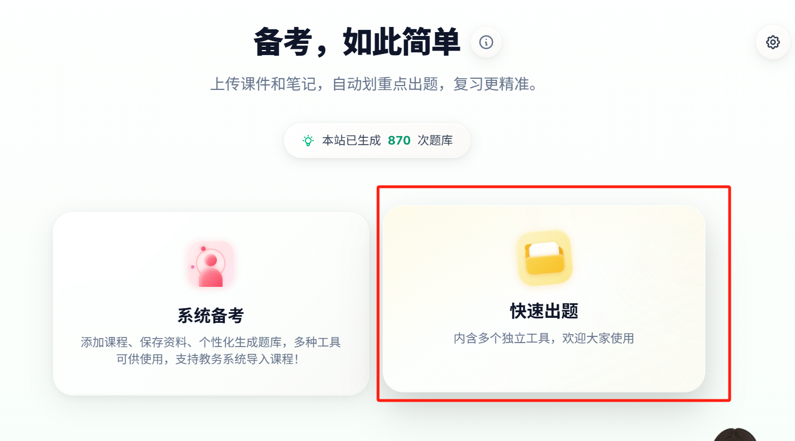

## 技术架构
1.AI能力使用**Google Cloud Agent Platform**。出题直接请求**Vertex AI(Gemini)**，思维导图生成和‘问Gemini’则是部署了**两个ADK Agent**到**Agent Runtime**，并自动注册进**Agent Registry**。

思维导图功能较为复杂，用到了**多agent架构**。**Gemini 2.5 pro**负责搭建骨架，设计节点。 **Gemini 2.5 flash lite**负责**并行**填充节点内容，生成具体题目。这样兼顾了生成速度和质量。

得益于Gemini强大的**多模态能力**，agent可以直接理解文件里的图文关系。利用gcp生态，agent可以读取gcs桶里的文件内容，无需再想办法解析文件。

2.后端使用**cloudflare worker**，负责登录鉴权（Google OAuth/邮箱验证码）、访客积分计费、Turnstile人机验证、SSE流式转发，并按开关把AI请求分流到Vertex AI或Agent Runtime。数据和文件分别存储在cloudflare的**D1**和**R2**库中，统计数据放在KV。

3.前端使用一系列静态页面+JavaScript，组合承担出题、练题、源文件查看、题目推荐、思维导图等交互功能，支持**简中/繁中/英/韩四种语言**。页面部署在vercel上。


## 项目亮点
1. **Agent能力无缝整合进传统学习流程**，不改变用户习惯。学生不用单独开一个聊天窗口，而是在正常学习的时候，**AI能力正好出现在学生需要的地方**。<u>*没有任何一个地方需要他自己‘说点什么’*</u>。
   
    ```python
    想象一个学生要考试了，他只需要点几个按钮，把课程导进去，点‘智能刷题’，系统就会把适合他的题目呈上来。
    碰到不会的题，可以直接查看原文是怎么说的，看不明白还可以问页面内的AI。
    如果他发现自己一点没学，可以顺手生成一个思维导图，看看这门课大概讲了什么。
    ```
    
   
2. **用户友好的设计**。使用原生api打通教育平台（**Moodle**）和AI能力（GCP agent），降低使用壁垒，让学生觉得‘这就是给我做的’。**多语言界面和输出**，自动探测用户语言，适合多元化的学生群体。

3. **已有真实用户验证**。本学期期末在校内测试，**获得800多次使用量，人均使用5次以上**。

4. **根据掌握情况，实时更新练习策略**。不会做的题会更频繁地推给你，如果频繁做错，系统将直接告诉你正确答案（把错误选项变为乱码）。这种方法类似短视频推送机制，只做最适合自己的题。和AI导师的聊天也会被考虑进**推荐算法**。每门课程有一个总体的‘熟练度’指标，反映用户的掌握程度。
   
5. 不仅要做题，还要让学生理解。**文件溯源**功能让用户及时查看题目对应的原文，知其然，也知其所以然。**思维导图**把知识点按逻辑关系拆解成彼此依赖的网络——只有理解了前面的，才能学后面的，这对数学物理这种逻辑学科很重要。

6. **深度使用谷歌生态，把最重的工程负担交给了平台**。文件解析不用自己写：**Gemini多模态+GCS** 让agent直接读懂PDF里的图文，整个文件解析层全省了。调度不用自己写：用 **ADK** 把两个生产级agent（答疑助教+图谱导学工作流）搭成声明式编排，**output_schema**结构化输出让JSON修复兜底代码直接消失。运维不用自己管：**Agent Runtime**托管部署和扩缩容，**Agent Registry**部署即注册，零配置。模型也不用将就：**Gemini 2.5 pro**搭骨架、**flash lite**并行填充节点，质量和成本各取所需。

    ```python
    一个直观的例子：思维导图的节点内容生成，原本是后端200多行手写调度（拓扑分批、失败重试、JSON修复兜底）。
    改成ADK工作流后，变成‘骨架agent+并行填充agent’的声明式编排，这些调度代码不再需要我们维护。
    ```
